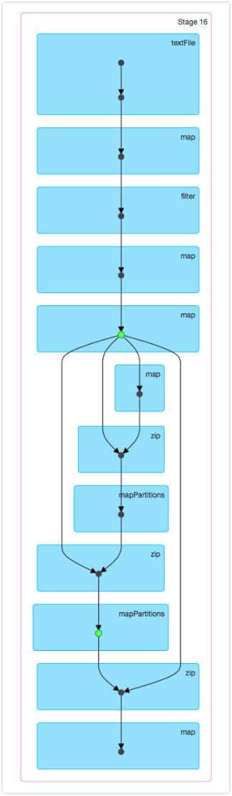
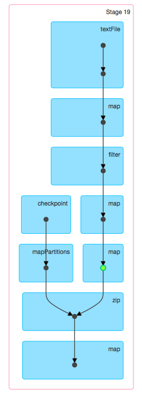

Recently, I partly finished GBDT algorithm on spark. When testing its performance with a large iteration times (>300), I meeted the `java.lang.StackOverflowError`.

##	Why the iterative algorithm can cause stack overflow error

The iterative algorithm with a large iteration times often has a long lineage and it causes a long/deep java object tree (DAG of RDD objects), which needs to be serialized as part of the task creation. When serializing, the whole object DAG needs to be traversed leading to the stackoverflow error.

The lineage of the GBDT algorithm I wrote was shown below (at 4th iteration),


## How to fix stack overflow error in iterative algorithm

Some people may deal with this problem by caching RDD, but it doesn't work. There is a difference between caching to memory and checkpointing, when considered from the lineage point of view.

*	When an RDD in checkpointed, the data of the RDD is saved to HDFS (or any Hadoop API compatible fault-tolerant storage) and the lineage of the RDD is truncated. This is okay because in case of the worker failure, the RDD data can be read back from the fault-tolerant storage.
*	When an RDD is cached, the data of the RDD is cached in memory, but the lineage is not truncated. This is because if the in-memory data is lost, the lineage is required to recompute the data.

So to deal with stackoverflow errors due to long lineage, just caching is not going to be useful and you have to checkpoint the RDD for every 20~30 iterations. The correct way to do this is to do the following:

1.	Mark RDD of every Nth iteration for caching and checkpointing (both).
2.	Before generating (N+1)th iteration RDD, force the materialization of this RDD by doing a rdd.count() or any other actions. This will persist the RDD in memory as well as save to HDFS and truncate the lineage. If you just mark all Nth iteration RDD for checkpointing, but only force the materialization after ALL the iterations (not after every (N+1)th iteration as suggested) that will still lead to stackoverflow errors.
	

After added checkpointing, the lineage of the GBDT algorithm I wrote changed to (at 4th iteration):



##Demo of Checkpointing

```
/* set checkpointing directory */
val conf = new SparkConf().setAppName(s"GBoost Example with $params")
val sc = new SparkContext(conf)
sc.setCheckpointDir(params.cp_dir) // params.cp_dir = hdfs://bda00:8020/user/houjp/gboost/data/checkpoint/

/* do checkpointing */
var output: RDD[Double] = init()
var iter = 1
while (iter <= num_iter) {
    val pre_output = output
    // iterative computation of output
    output = getNext(pre_output).persist()
    // checkpoint every 20th iteration
    if (iter % 20 == 0) {
        output.checkpoint()
    }
    // force the materialization of this RDD
    output.count()
    pre_output.unpersist()
    iter += 1
}
```
## References
</h2>

1.	[http://apache-spark-user-list.1001560.n3.nabble.com/java-lang-StackOverflowError-when-calling-count-td5649.html](http://apache-spark-user-list.1001560.n3.nabble.com/java-lang-StackOverflowError-when-calling-count-td5649.html)


